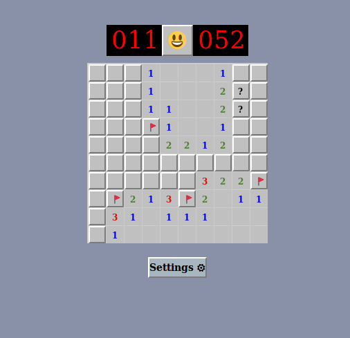

# Minesweeper with Rust and WebAssembly
This project is an implementation of the classic Windows [minesweeper](https://en.wikipedia.org/wiki/Microsoft_Minesweeper) 
game using [Rust](https://www.rust-lang.org), [WebAssembly](https://webassembly.org/) and javascript/html.

Rust performs the game logic and maintains game state, while Javascript does the event handling and rendering
of the game's UI elements to a 2D canvas.

Admittedly, minesweeper is not the most demanding of games, and probably overkill for wasm's performance improvements.
Nonetheless, it was a great learning experience into the basics of WebAssembly with Rust.

 

## Prerequisites
Familiarity with rust and node package manager.

To run and build the project you will need rust, npm and some other WebAssembly tools as listed [here](https://rustwasm.github.io/docs/book/game-of-life/setup.html)
I used Rust 1.37 and npm 6.11.2 to develop this project on a linux machine.

### Building
1. from the project root directory run `wasm-pack build` which will create a `./pkg` directory and compile rust 
source files into a WebAssembly (.wasm) binary
2. cd into the `www` directory and run `npm install`

### Running (option 1) 
This option uses the webpack development server to serve the html,javascript and wasm files required for the game. This
is the easiest option if you have Rust and npm installed locally on your machine.

1. from within the `www` directory, start the webpack local development server by running: `npm run start`
2. go to the page at `http://localhost:8080` in your browser of choice
3. start minesweeping

### Running (option 2)
This option allows you to use your web-server of choice to host the game files. For example, could use busybox, instant python
web server, Apache, NGINX etc... The caveat is that you must first configure the web-server to recognize the 
`application/wasm` MIME type (if it doesn't already). Once configured, copy all files from 
the [www/dist](./www/dist) to your web-server.  

### project directories
* rust source code is in the [src](./src) directory
* the main javascript logic is [here](./www/index.js) and [here](./www/minesweeper-state.js)
* the nodejs project containing javascript, html, and css source files are in the [www](./www) directory
* the [www/dist](./www/dist) directory contains all final compiled files used by the game, including: html,css,js 
and wasm. You could deploy these to your web-server of choice (just be sure to configure your server to recognize
 the`application/wasm` MIME type)
